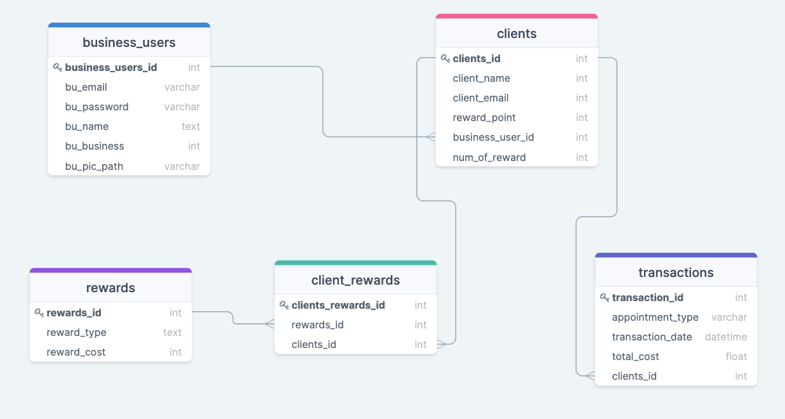

# GlowUp - customer loyalty app

Glow Up is created with VScode

A point based loyalty program geared towards small business owners of the spa & aesthetician community.

###Introduction
The GlowUp web app is the culmination of my bootcamp experience. My Hackbright capstone project,
GlowUp reinforced all information that the bootcamp has stuffed into my brain within the bootcamp's limited time frame.

##Table of Contents

##General Info
This project is a customer loyalty rewards programs, tallying up customer points to redeem later on for rewards promoted 
by the business user.

##Technologies
Project is created with:
  Python, JavaScript, AJAX, JSON, HTML, CSS
  Flask, jQuery, Bootstrap, Jinja, bcrypt, WTForms
  PostgreSQL, SQLAlchemy

##Setup
Not to sure how to run this project for you, besides cloning the repo. (Will return to this later
when I get more experience as a coder--apologies in advance)

##Data Model

#Project Status
Still a work in progress...

